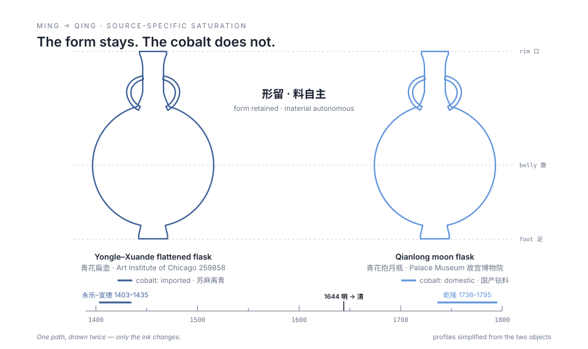
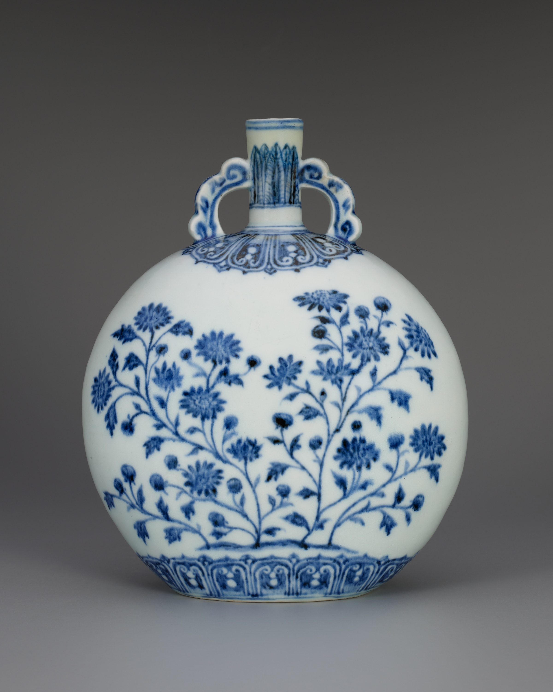
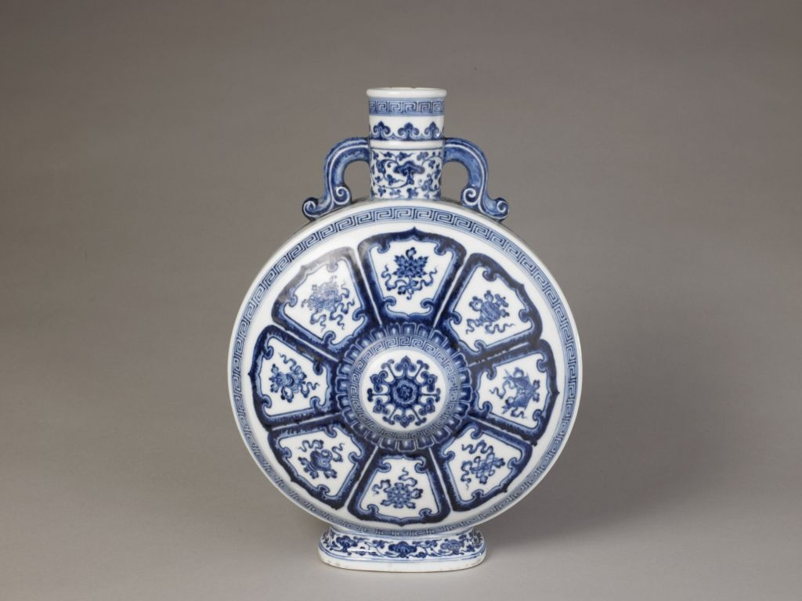

# Ziyang-Ceramic-Research

What actually changed between Ming and Qing ceramics — measured, not argued.

*Frontiers in Art Research* · Vol. 8, Issue 2, pp. 65–74 · 2026
DOI [10.25236/FAR.2026.080211](https://doi.org/10.25236/FAR.2026.080211) · Francis Academic Press, UK · sole author

**[▶ The interactive version — a 5-dimension lens over the objects](https://jerryxugit-2026.github.io/Ziyang-Ceramic-Research/)**

---

## The question

"Chinese porcelain influenced the world" is the kind of sentence that wins
arguments and explains nothing. Influenced *whom*, in *which* respects, and
did the influence keep growing — or did the whole network change shape?

Art history usually answers by citing objects until the other side runs
out. I wanted a way to lose the argument if I was wrong.

## What I did

148 ceramic objects across three regions (China, Middle East/West Asia,
Europe), three circulation roles (local, export, import) and two dynasties.
Every object is scored **0 / 1 / 2 on five dimensions — theme, style, form,
pattern, colour — against all three regional standards at once**, so a
single plate gets nine dimension-level judgments, not one verdict. Summing
and averaging gives each role-group a cross-regional integration index.

The point of the apparatus is not precision for its own sake: it makes the
claim *falsifiable*. Anyone who disagrees with a score can re-score the
object and re-run the sums.

## Results

Quoted from Table 2 of the paper (integration indices, 0–20 scale):

| Direction | Ming | Qing | Change |
|---|---|---|---|
| China local · Middle East/West Asia | 6.7 | 6.9 | +0.2 |
| China local · Europe | 5.6 | 5.6 | 0 |
| China output → Middle East/West Asia | 5.4 | 5.0 | −0.4 |
| China output → Europe | 3.2 | 6.3 | **+3.1** |
| China input ← Middle East/West Asia | 5.0 | 2.0 | **−3.0** |
| China input ← Europe | 1.0 | 5.6 | **+4.6** |

Two findings:

1. **Network reorganization, not "more exchange."** The Ming-era structure —
   symmetric integration with the Middle East as hub — withdrew completely
   in the Qing; a direct China–Europe axis rose to replace it.
2. **Source-specific saturation.** During the Qing, imports from the
   Islamic world collapsed (5.0 → 2.0) while local Chinese–Islamic
   integration *rose* (6.7 → 6.9). Once a foreign element is internalized
   into local production, it no longer needs its source.

## The clearest pair of evidence

The Yongle–Xuande flattened flask
([Art Institute of Chicago 259858](https://www.artic.edu/artworks/259858), CC0)
and the Qianlong moon flask (Palace Museum, 新00118010 —
[the museum's collection portal](https://www.dpm.org.cn/explore/collections.html)).
Same silhouette, three centuries apart. The Ming flask is Islamic twice
over — Persian cobalt in the glaze, a metalwork prototype in the form. The
Qianlong flask keeps the form and sources everything at home: Zhejiang and
Yunnan cobalt, domestic production, stable output.

<picture>
  <source media="(prefers-color-scheme: dark)" srcset="assets/form-retained-dark.svg">
  
</picture>

*The drawing is one SVG path used twice — the form is literally shared;
only the ink changes. Which is the argument.*

| | |
|---|---|
|  |  |
| Yongle–Xuande flattened flask. Art Institute of Chicago, 259858. CC0. | Qianlong moon flask, Eight Treasures motifs. © The Palace Museum (新00118010), reproduced with permission. |

## What this doesn't show

- The 0/1/2 scores are my judgments, applied through a fixed rubric. The
  rubric makes them checkable, not objective.
- Samples come from published museum collections — objects that survived
  and were collected, which is its own bias.
- This is a study of artistic representation, not of trade volume.
  Economic and institutional history enters only as explanation, never as
  evidence.

## The paper

> Xu, Z. (2026). Network reorganization of cross-regional cultural
> integration in Ming-Qing ceramics: A three-region comparison and
> five-dimensional diagnosis. *Frontiers in Art Research, 8*(2), 65–74.
> https://doi.org/10.25236/FAR.2026.080211

---

*One of four directions on [my profile](https://github.com/jerryxugit-2026) —
physics, art history, AI tooling, and public systems.*
